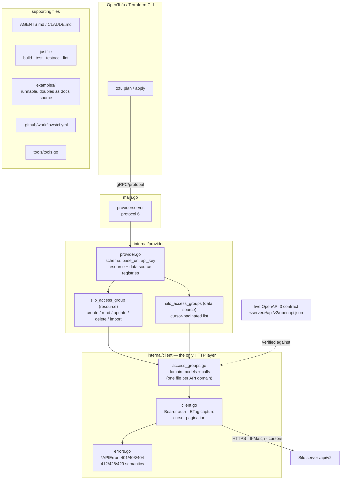

# silo-server-tofu

An [OpenTofu](https://opentofu.org) (and Terraform-compatible) provider for
[Silo](https://github.com/Silo-Server) — the self-hosted media server on
modern infra. The provider turns server **configuration** into infrastructure
as code through Silo's `/api/v2` HTTP API: accounts, access groups, libraries,
collections, API keys, invite codes, settings, and the rest of the
administrative plane.

Status: **early implementation**. The provider builds and serves; access
groups, accounts, and API keys have resources and list data sources. See the
[coverage roadmap](#coverage-roadmap) for what lands next.

## Why

Silo servers are configured through admin CRUD APIs with ETag-guarded writes,
cursor pagination, and capability flags. Managing that config with OpenTofu
gives you plans, drift detection, and reviewable, reproducible server setup —
one module that stands up a whole household: accounts with the right access
groups, invite codes, API keys, and library assignments.

## Requirements

- OpenTofu 1.7+ (or Terraform 1.7+)
- Go 1.25+ to build from source
- A Silo server, and an **admin-owned API key** for admin resources
  (keys inherit their owner's permissions)

## Install

```hcl
terraform { # tofu init works the same
  required_providers {
    silo = {
      source  = "registry.opentofu.org/silo-server/silo"
    }
  }
}

provider "silo" {
  base_url = "https://silo.example.org"
  api_key  = var.silo_api_key
}
```

Both provider attributes can also come from environment variables
(`SILO_BASE_URL`, `SILO_API_KEY`). The key is stored as a sensitive value;
it is never written to plan files.

## Example

```hcl
resource "silo_access_group" "family" {
  name              = "Family"
  description       = "Household members, all libraries"
  download_allowed  = true
  requests_allowed  = true
  max_streams       = 4
}

data "silo_access_groups" "all" {}

output "group_names" {
  value = [for g in data.silo_access_groups.all.access_groups : g.name]
}
```

## Scaffold



Layering is strict and one-directional:
`main.go → internal/provider → internal/client → Silo /api/v2`.
Only `internal/client` talks HTTP; only `internal/provider` knows about
tfsdk types.

## Coverage roadmap

Priority is the configuration plane; runtime surfaces (playback, progress,
favorites) are out of scope as resources. Beta-marked API areas wait until
they graduate.

| API domain | Provider surface | Status |
| --- | --- | --- |
| Access groups | `silo_access_group` (resource), `silo_access_groups` (data source) | pattern implementation |
| Accounts / users | `silo_account` (resource), `silo_accounts` (data source) | implemented; acceptance tested on the throwaway dev server |
| API keys | `silo_api_key` (resource), `silo_api_keys` (data source) | implemented; acceptance tested on the throwaway dev server |
| Libraries | `silo_library` (resource), `silo_libraries` (data source) | planned |
| Collections | `silo_collection`, `silo_collection_group` | planned |
| Invite codes | `silo_invite_code` | planned |
| Settings (server) | `silo_settings` | planned |
| Autoscan | `silo_autoscan_source`, `silo_autoscan_connection` | planned |
| Notifications | `silo_notification_channel` | planned |
| Request routing | `silo_request_route`, `silo_request_group` | planned |
| Capabilities / system | `silo_capabilities`, `silo_server` (data sources) | planned |
| Branding, sections, plugins | data sources / resources | candidate |
| Playback, progress, watch-together, favorites | — | out of scope |
| Jellyfin / Audiobookshelf compat | — | out of scope |

## Development

```sh
just build          # go build -o bin/terraform-provider-silo .
just test           # offline unit tests — no server needed
just tofu-validate  # build + `tofu validate` every example via dev_overrides
just lint           # golangci-lint + `tofu fmt -check` on examples
just generate       # provider docs from examples (tfplugindocs)
```

Acceptance tests create and destroy real resources, run the OpenTofu CLI
(wired automatically via `TF_ACC_TERRAFORM_PATH`), and are gated behind env
vars pointing at a **throwaway** server:

```sh
TF_ACC=1 SILO_ACC_BASE_URL=http://localhost:8090 \
  SILO_ACC_API_KEY=<test-admin-key> just testacc
```

To develop against a locally running provider, use
[dev_overrides](https://opentofu.org/docs/intro/usage/dev-overrides/) or the
`--debug` flag with a debugger.

Agent workflow (adding resources, conventions, API contract rules) is
documented in [AGENTS.md](./AGENTS.md) — the source of truth for how this
repo is worked on.

## References

- Silo docs: <https://siloserver.org/docs> — API usage guide:
  <https://siloserver.org/docs/api>
- Your server's interactive reference: `<server>/api/v2/docs`, and the
  OpenAPI document at `<server>/api/v2/openapi.json` — the live contract
  this provider implements against; it is not vendored in this repo

## Legal

Licensed under the [AGPL-3.0-or-later](./LICENSE), matching the rest of the
Silo ecosystem (server and website).

This project is an independent provider *for* Silo. The Silo name, logo, and
wordmark are trademarks of Silo Media L.L.C. Referential use like "provider
for Silo" is permitted; forks must not use the Silo brand as their identity.
